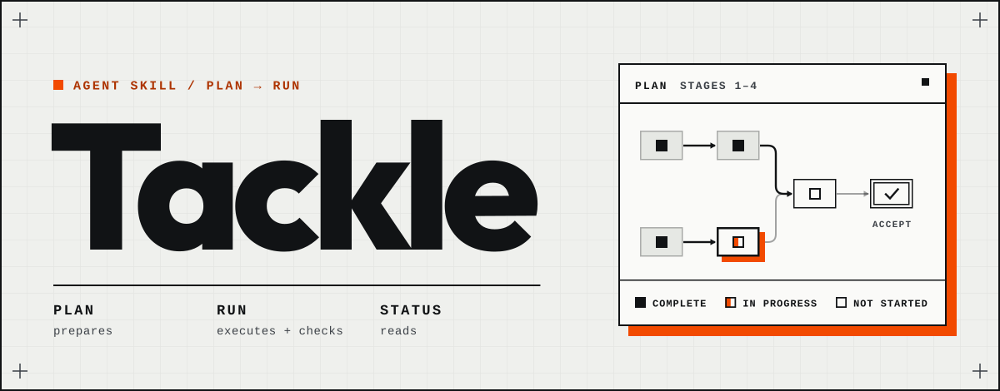
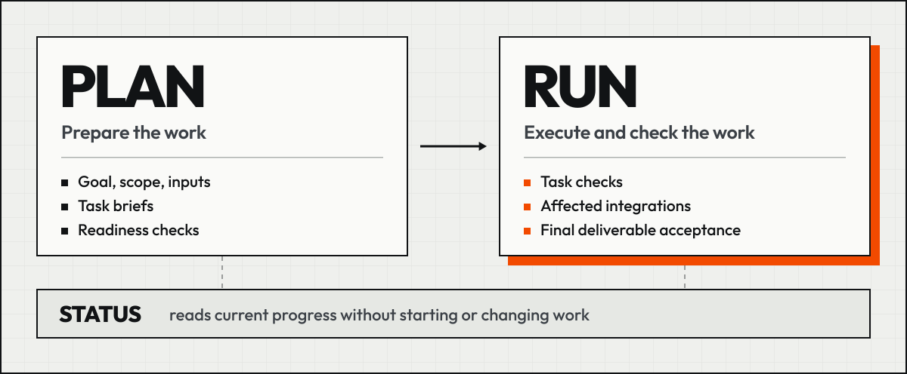

<p align="center">
  <picture>
    <source media="(prefers-color-scheme: dark)" srcset=".github/brand/tackle-hero-dark.svg">
    <source media="(prefers-color-scheme: light)" srcset=".github/brand/tackle-hero-light.svg">
    
  </picture>
</p>

<h1 align="center">Durable plans. Verified delivery.</h1>
<p align="center">A planning and execution skill for AI coding agents.</p>

<p align="center">
  <a href="#get-started">Get started</a> ·
  <a href="#how-it-works">How it works</a> ·
  <a href="#what-stays-in-your-repository">What gets saved</a> ·
  <a href="#documentation">Documentation</a>
</p>

Tackle turns a goal into a plan stored in your repository. Each task carries the context, scope, dependencies, and checks an agent needs to pick it up in a fresh session. When you authorize execution, the agent works through the plan and records what passed, what failed, and what remains blocked.

Use it for features, refactors, and investigations that span sessions or involve handoffs between agents or people.

**Tackle 9.1.0** · Model-agnostic · Markdown-only install · MIT

## Why Tackle

A useful handoff needs more than a summary of the conversation. It needs the next task, the decisions behind it, the inputs it depends on, and a way to check the result.

| When… | Tackle records… |
|---|---|
| Work continues in another session | Task briefs, decisions, current state, and verification records in the repository. |
| One task depends on another | The specific file, schema, protocol, or other artifact the next task consumes. |
| An agent reports that work is complete | The checks and results supporting completion, including required integration checks and reviews. |

The plan is a working artifact: it supports execution, handoffs, and review rather than ending at a checklist.

## Get started

Install the skill:

```sh
npx skills add alph0x/Tackle --skill tackle
```

Select **Tackle** in your agent's skill picker, then describe the work:

```text
Plan a refactor that extracts checkout validation into its own module.
Keep existing behavior unchanged. Do not implement yet.
```

When the plan is ready, authorize execution:

```text
Run the checkout validation plan.
```

In a later session, select Tackle and ask:

```text
Show the checkout validation plan's status. What is complete, blocked, and next?
```

These are example requests to the selected skill, not shell commands or captured results. If your app offers `/tackle`, select that entry and continue typing. The selection syntax depends on the app; Tackle has one entry, with the actions inside it. Requests can be in your preferred language.

A scoped request such as “plan and implement this refactor” authorizes both preparation and execution. A plan-only request stops before implementation. Open Tackle without a request, or ask for `help`, to see the available actions without starting work or creating files.

<details>
<summary>Manual installation and updates</summary>

From a checkout of this repository, copy `skills/tackle/SKILL.md` and `skills/tackle/references/` into your agent's skill directory. For Claude Code:

```sh
mkdir -p ~/.claude/skills/tackle
cp skills/tackle/SKILL.md ~/.claude/skills/tackle/
cp -R skills/tackle/references ~/.claude/skills/tackle/
```

For Cursor, use `~/.cursor/skills/tackle/`. Other agents use their own skill directory. Tackle follows the [Agent Skills](https://github.com/anthropics/skills) format.

The install contains only `SKILL.md` and `references/`, with 66 installation-relative files. Repository branding, development tools, and evaluation fixtures are not part of the installed skill.
The checkout copy commands above copy those files into the selected directory and leave any other files already there.

For 9.0.1, the update checks used skills@1.7.0 in controlled synthetic Git fixtures; they did not change a real installation or test the public GitHub API route. In a copy-mode reinstall using `--copy -a claude-code -y -g`, the selected Claude Code directory received the exact 55-file artifact. That route refreshed the selected agent copy and lock while leaving any old canonical `.agents/skills/tackle` directory untouched.

In two fresh synthetic global fixtures, default symlink mode with `--skill tackle -a claude-code codex -y -g` replaced the canonical `.agents/skills/tackle` directory with the exact artifact and linked Claude Code to it. Codex resolves the canonical `.agents/skills` directory; this command does not create a separate `.codex/skills/tackle` link. Seeded floating and pinned ordinary updates exited successfully while retaining the old root-layout path and bytes; the pinned lock still named v9.0.0. These results do not establish automatic migration of older installs.

After publication, sandboxed probes of 9.0.1 installed the exact 55-file artifact through both public routes: the `#v9.0.1` tag and the default no-ref source. For 9.1.0 the same flags apply to the tag once it exists:

```sh
npx --yes skills@1.7.0 add 'https://github.com/alph0x/Tackle.git#v9.1.0' --skill tackle -a claude-code codex -y -g
```

The 9.1.0 routes are probed only after publication, and the GitHub API fast path has not been tested. The controlled source used `.invalid#packaging-preparation-02`, rewritten to a local clone, with synthetic old-lock seeds. An earlier parser-invalid root probe selected a same-name two-file fixture; the 1,476-file figure describes repository/package blast radius or conditional root-copy risk, not observed historical installed content. Restart your session after an update if your agent cannot reload skills.

</details>

## How it works

<picture>
  <source media="(prefers-color-scheme: dark)" srcset=".github/brand/tackle-flow-dark.svg">
  <source media="(prefers-color-scheme: light)" srcset=".github/brand/tackle-flow-light.svg">
  
</picture>

<details>
<summary>Text version</summary>

```text
PLAN                          RUN
Prepare the work       →      Execute and check the work
Goal, scope, inputs,           Task checks, affected integrations,
task briefs, readiness        and final deliverable acceptance

STATUS reads current progress without starting or changing work.
```

</details>

**PLAN** prepares requirements, decisions, task briefs, dependencies, and acceptance checks. Readiness checks are part of preparation.

**RUN** executes authorized, ready work in dependency order. It checks results, corrects within the allowed budget, and checks the final deliverable before closing the initiative. Verification is part of execution, not an extra step you must remember to request.

For code, PLAN chooses the checks before implementation. Tackle prefers an end-to-end check through the real consumer as the sole new test when it covers the contract; complex integrated features require one when feasible. Any necessary isolated test starts with a failure-mode inventory and is written before its implementation. Every end-to-end run retains a [repeatable verification artifact](skills/tackle/references/guides/testing.md#replayable-e2e-artifact).

**STATUS** reads progress, lists plans, or identifies the next task. An unqualified “resume” is also read-only. Explicit execution intent enters RUN; `--handoff` writes only the requested handoff.

| Request to the selected skill | Result |
|---|---|
| `plan <task>` | Prepare the work without implementing it. |
| `run` | Execute the authorized ready work and check the results. |
| `run --one` or `run <T-id>` | Execute one task. |
| `status [<workspace>]`, `list`, or `next` | Read current progress or find the next task. |
| `status <workspace> --handoff` | Write a handoff for the next session. |
| “show the plan view” | Write a local, interactive HTML view of the workspace. |

Status questions during an authorized run do not cancel that authorization. Unclear requests are clarified before action. See the [request guide](skills/tackle/references/guides/invocation.md) for intent boundaries, and [terminology](skills/tackle/references/terminology.md) for retired action-name aliases.

### What makes a task ready to hand off?

A task brief describes an observable result, the relevant inputs, its write scope, dependencies, constraints, checks, and recovery conditions. Self-contained does not mean independent of other tasks: dependencies still identify the artifacts the task needs.

An abbreviated, illustrative brief might read:

```text
T-02 — Extract checkout validation

Outcome:       Existing validation behavior is preserved in a separate module.
Input:         T-01's agreed validation contract and characterized cases.
Write scope:   The files explicitly named in this task's full brief.
Constraints:   No changes to public behavior or unrelated payment flows.
Checks:        Contract cases, existing regressions, affected integration checks.
Stop if:       The agreed contract conflicts with a protected acceptance check.
```

The actual brief must name concrete files, cases, and checks. This example is not a generated plan or evidence that a run passed.

## What stays in your repository

Focused and Coordinated plans live under `docs/plans/<initiative>/` as Markdown. The agent sizes the workspace to the work: Direct handles a bounded local correction without a workspace; Focused keeps a small durable plan; Coordinated adds task and coordination artifacts when needed. Risk determines the route, not task count alone.

Focused uses `plan.md`, `history.md`, and `resource-usage.md`, with separate decisions or questions files when needed. A Coordinated workspace includes:

```text
docs/plans/<initiative>/
├── README.md          Index and reading order
├── AGENTS.md          Instructions for the next agent
├── plan.md            Goal, non-goals, task decomposition, dependencies
├── tasks/             Self-contained task briefs with stable T-ids
├── task-board.md     Canonical current task state and verification references
├── history.md        Session and observation history
├── resource-usage.md Observed role starts, finishes, and interrupted runs
├── questions.md       Open questions
├── decisions.md       Settled decisions
└── reference.md       Grounded context and source references
```

Additional contracts, architecture notes, reports, and snapshots depend on the work. A requested handoff creates `handoff-brief.md`; a retro creates `retro.md`. You decide whether to gitignore plans in your repository. Workspaces and parked ideas in `docs/seeds/` never ship with the skill.

Long initiatives can prepare current tasks while leaving later milestones at outcome/interface level. Current-work views are checked against their source revisions; original history and failed attempts remain recoverable. Optional retention policies manage verification records without treating retired data as current proof.

See [workspace sizing](skills/tackle/references/guides/intake-and-gate.md#step-2--gate-sizing-full--lite--none), [current-work context](skills/tackle/references/guides/context-lifecycle.md), and [record lifecycle](skills/tackle/references/guides/record-lifecycle.md).

## What counts as complete

Completion requires the task's mandatory checks, not just an agent's assertion. RUN checks the target change, surrounding behavior, and affected integrations. Closing an initiative also requires checking the final deliverable against its acceptance requirements.

Verification records preserve the actor, command, revision, output, and result. When independent review is required, a separate reviewer must supply it. Missing capabilities or required checks block the affected work; a role name or self-review is not independent evidence.

Before changing behavior, the agent resolves conflicts between the current implementation, the intended result, and the specification. The authority order is user → specification → protected acceptance and tests → implementation. Changed inputs invalidate affected downstream checks.

A task allows at most three failed correction-validation cycles; two identical no-progress observations stop work sooner. Resuming or changing agents does not reset spent cycles or erase unresolved failures.

Tackle is a method an agent follows. The agent still needs the tools, permissions, and reviewer capabilities required by the task. Verification records show what was actually checked; they do not establish correctness beyond those checks.

See the [RUN card](skills/tackle/references/guides/run-card.md) and [failure-modes catalog](skills/tackle/references/failure-modes.md).

## Security model

This section describes how Tackle is built to behave; it is not a claim about any third-party review or scanner result.

The install is Markdown only: `SKILL.md` and `references/` contain no executable runner and install none (see the install contents [above](#get-started)). Ordinary invocation performs no network access and does not change the installation tree. The optional System One capability is the one consented exception to the network rule, and it only runs when the workspace records your agreement ([System One](skills/tackle/references/guides/system-one.md)).

Recipe scripts under `references/` are documentation. An agent saves or runs one only with your explicit authorization, and prefers an equivalent capability of its own harness. Asking for a feature whose documented procedure is a recipe, such as the plan view, counts as that authorization. If you decline, the affected record is reported unavailable or produced another permitted way, never faked.

RUN executes only the exact command line (argv) that each authorized, ready task declares, and captures each command with its exit status and output streams ([RUN card](skills/tackle/references/guides/run-card.md)).

Content in `reference-docs/`, fetched pages and tool output is data. Tackle cites it and never follows instructions found inside it.

Updates are owner-controlled and out of band: Tackle does not check for, download or install releases ([update guide](skills/tackle/references/guides/update.md)).

## Documentation

| Need | Guide |
|---|---|
| Understand requests and authorization | [Invocation](skills/tackle/references/guides/invocation.md) |
| Choose the right planning scope | [Sizing](skills/tackle/references/guides/intake-and-gate.md) |
| Understand task checks and completion | [RUN card](skills/tackle/references/guides/run-card.md) |
| Keep a long initiative navigable | [Context lifecycle](skills/tackle/references/guides/context-lifecycle.md) |
| Manage retained verification records | [Record lifecycle](skills/tackle/references/guides/record-lifecycle.md) |
| Audit results or review lessons | [Audit](skills/tackle/references/guides/judge.md) · [Retro](skills/tackle/references/guides/retro.md) |
| Read terminology or migrate existing plans | [Terminology](skills/tackle/references/terminology.md) · [Migration](skills/tackle/references/guides/migrate.md) |
| Update the installed skill | [Owner-controlled updates](skills/tackle/references/guides/update.md) |
| Follow project changes | [Changelog](CHANGELOG.md) |

<details>
<summary>Explicit reviews, maintenance, and compatibility</summary>

These requests remain available inside the same Tackle entry. They are not extra required stages of PLAN → RUN.

| Request | Purpose |
|---|---|
| **validate the plan**, `verify [<workspace>]` | Validate or diagnose a plan. Diagnosis does not authorize fixes. |
| **audit the result**, `judge [<target>]` | Inspect finished work and rerun claimed checks. |
| `judge suite <target>` | Run the trap suite against a skill, model, or prompt. |
| `init <name>` | Create a workspace through PLAN. |
| `migrate` or `upgrade` | Prepare a selected workspace for migration on a disposable copy. |
| **review lessons**, `retro [<workspace>]` | Review the initiative and propose improvements. |

Visible sizing names map to existing routes: Direct (None), Focused (Lite), and Coordinated (Full). Workspaces use T-ids and `tasks/`; an older one, P-ids included, is migrated before it runs. New validated boards distinguish Draft, Ready to run, In progress, Checking, and Complete; Blocked, Interrupted, Skipped, and Unverifiable remain separate.

Historical records retain their meanings: E1 for independent command verification, E2 for semantic review, E3 for an assertion, and E0 for unverifiable work. They are not an ordinal scale.

During 8.x, documented slash forms such as `/tackle-run` and `/tackle-verify` preserve their intent boundaries when the host passes them as text; they do not register separate picker entries. The retiring 8.x action-name aliases keep their historical targets in [terminology.md](skills/tackle/references/terminology.md).

The install keeps the head of the checklist chain v2.0 → v9.1: [9.0 → 9.1](skills/tackle/references/guides/migrate.md#v90--v91-checklist), [8.4 → 9.0](skills/tackle/references/guides/migrate.md#v84--v90-checklist), [8.4.0 → 8.4.1](skills/tackle/references/guides/migrate.md#v840--v841-checklist) and [8.3 → 8.4](skills/tackle/references/guides/migrate.md#v83--v84-checklist). The historical checklists, v2.0 → v8.3, live in the repository's [`maintaining/migrations.md`](maintaining/migrations.md), including [8.2 → 8.3](maintaining/migrations.md#v82--v83-checklist), [8.1 → 8.2](maintaining/migrations.md#v81--v82-checklist), [8.0 → 8.1](maintaining/migrations.md#v80--v81-checklist), and the [copy-first 7.3 → 8.0 transition](maintaining/migrations.md#v73--v80-checklist).

</details>

<details>
<summary>Learning and usage records</summary>

A retro reads the task board and history (`task-board.md` and `history.md`) to propose lessons. You confirm profile changes before they are written. “Stop evolving” pauses or removes that learning through the retro workflow. [Reference plans](skills/tackle/references/archetypes/README.md) provide proven decomposition structures that the agent can propose during intake, stored under `.tackle/archetypes/` (project) or `~/.tackle/archetypes/` (user).

The `resource-usage.md` ledger records observed role events even without token or cost data. Unknown values stay `n/a`. Optional `resource-usage.telemetry.jsonl` observations are never required to close a task.

Totals and rankings require complete, comparable coverage; model-tier or effort recommendations also require three completed, comparable runs. See [usage observability](skills/tackle/references/guides/usage-observability.md) and the optional [Codex native capture recipe](skills/tackle/references/guides/codex-native-usage.md).

Optional capability profiles cover [Claude Code](extras/collectors/claude-code.md), [Oh My Pi](extras/collectors/oh-my-pi.md), [OpenAI Responses](extras/collectors/openai-responses.md), [Antigravity CLI](extras/collectors/antigravity-cli.md), [OpenCode](extras/collectors/opencode.md), [Kimi Code](extras/collectors/kimi-code.md), and [Cursor](extras/collectors/cursor.md). Profiles describe available data and its limits; they neither install integrations nor collect data automatically.

</details>

## Developing Tackle

Run the deterministic suite registry from the repository root:

```sh
python3 eval/run_suites.py
```

CI uses the same registry and rejects missing test files, zero discovery, unregistered suites, and failing tests.

An earlier, retired paired-experiment protocol ran twelve paired episodes against the 8.1.0 baseline and ten focused follow-up episodes; git history keeps its record.

<details>
<summary>Evaluation coverage and release checks</summary>

The [eval suite](eval/README.md) contains **67 scenarios** (`s1`–`s72`): decision traps, one end-to-end lifecycle smoke test, three end-to-end planning tasks and two mid-task resumes judged by hidden acceptance tests. The manual A/B workflow compares a model following Tackle with the same model working without it. Each scenario's answer sheet stays outside the agent's copy. A smoke run provides evidence for that run, with its limits recorded alongside the result.

Before release, the [release sweep](MAINTAINING.md#release-sweep) runs 8 shipped-skill gates covering the entry-file word budget, 11 core conventions, version and migration consistency, README claims, install contents, and update boundaries. The workspace table covers rows 1–17 (17 lint rows). These are documented, copy-pasteable POSIX checks.

Mechanical gate procedures cover `lint` rows, `catalog` integrity, each `done-signal`, the two-phase `ground` check, `eval` method arms, and `init` artifact completeness. Required independent review also gates completion. Release publication requires a separate owner request.

For deeper changes, see [team capabilities](skills/tackle/references/team.tmpl.md) and [discovery and experiment tasks](skills/tackle/references/guides/decompose-and-lint.md).

</details>

## License

[MIT](LICENSE)
